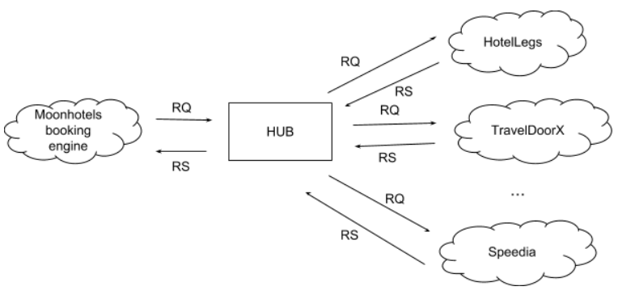

# Moonhotels' HUB
Moonhotels, a new FDSA's client, is a company that sells hotel room stays. Its core product is a booking engine that connects to external providers to return the availability of rooms and applies Moonhotels business rules.

As a solution to the technical debt that has been increasing in the last years, they decided to create a new HUB that will be in charge of requesting information from the providers and aggregate the results in a unique, consolidated response.

This new HUB will only have one method, Search, that will execute the following flow:
1. Receive a search request in common format (HUB format).
1. Translate the HUB's search request to multiple search requests, one for every provider. All providers have a different search format.
1. Translate every provider response (in a different format for each one) to a response in the HUB format.
1. Aggregate the different responses in only one.

The HUB will connect to a lot of different providers: HotelLegs, TravelDoorX, Speedia, etc.

For an initial phase of the project, there are two main tasks:
1. Create the HUB system that allows to connect to several providers.
1. Create the HotelLegs provider integration.

## Architecture overview


## HUB Search format
Request:
```json
{
    "hotelId": 1,
    "checkIn": "2018-10-20",
    "checkOut": "2018-10-25",
    "numberOfGuests": 3,
    "numberOfRooms": 2,
    "currency": "EUR"
}
```
Response:
```json
{
    "rooms": [
        {
            "roomId": 1,
            "rates": [
                {
                    "mealPlanId": 1,
                    "isCancellable": false,
                    "price": 123.48
                },
                {
                    "mealPlanId": 1,
                    "isCancellable": true,
                    "price": 150.00
                }
            ]
        },
        {
            "roomId": 2,
            "rates": [
                {
                    "mealPlanId": 1,
                    "isCancellable": false,
                    "price": 148.25
                },
                {
                    "mealPlanId": 2,
                    "isCancellable": false,
                    "price": 165.38
                }
            ]
        }
    ]
}
```

## HotelLegs Search format
Request:
```json
{
    "hotel": 1,
    "checkInDate": "2018-10-20",
    "numberOfNights": 5,
    "guests": 3,
    "rooms": 2,
    "currency": "EUR"
}
```
Response:
```json
{
    "results": [
        {
            "room": 1,
            "meal": 1,
            "canCancel": false,
            "price": 123.48
        },
        {
            "room": 1,
            "meal": 1,
            "canCancel": true,
            "price": 150.00
        },
        {
            "room": 2,
            "meal": 1,
            "canCancel": false,
            "price": 148.25
        },
        {
            "room": 2,
            "meal": 2,
            "canCancel": false,
            "price": 165.38
        }
    ]
}
```

## Goal
Your task is to develop the **domain** of the HUB. In summary, you have to implement:
* The HotelLegs connector that, given a HUB request, it calls the HotelLegs API and returns a HUB response. 
* The HUB infrastructure that, given a a HUB request, calls all available connectors, returns their responses and aggregates them in a single response.

You don't have to worry about any other infrastructure details, like the HTTP call to the provider or the JSON response you would receive from it, as you can just simulate or mock this response (for example, hardcoding it). For this test, just imagine that this details will be handled by other team members.

However, keep in mind that you must define a ```IHotelLegsAPI``` interface with the Search method, as another team member will develop the implementation that performs the real HTTP request.
